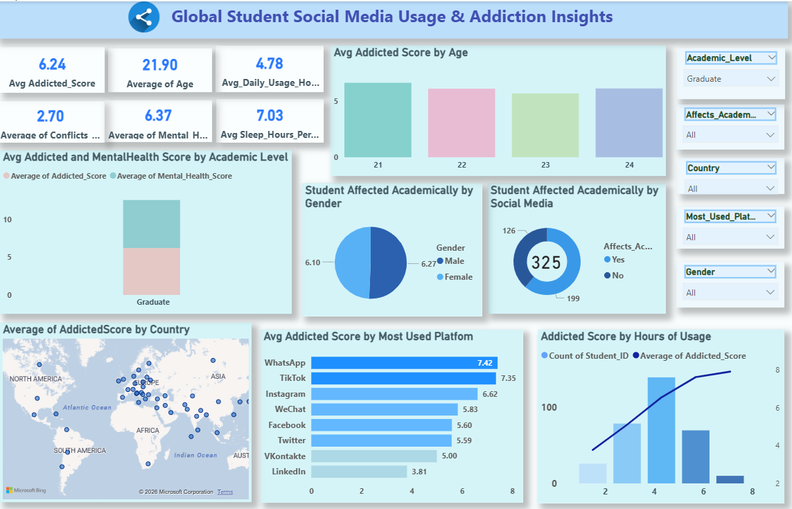
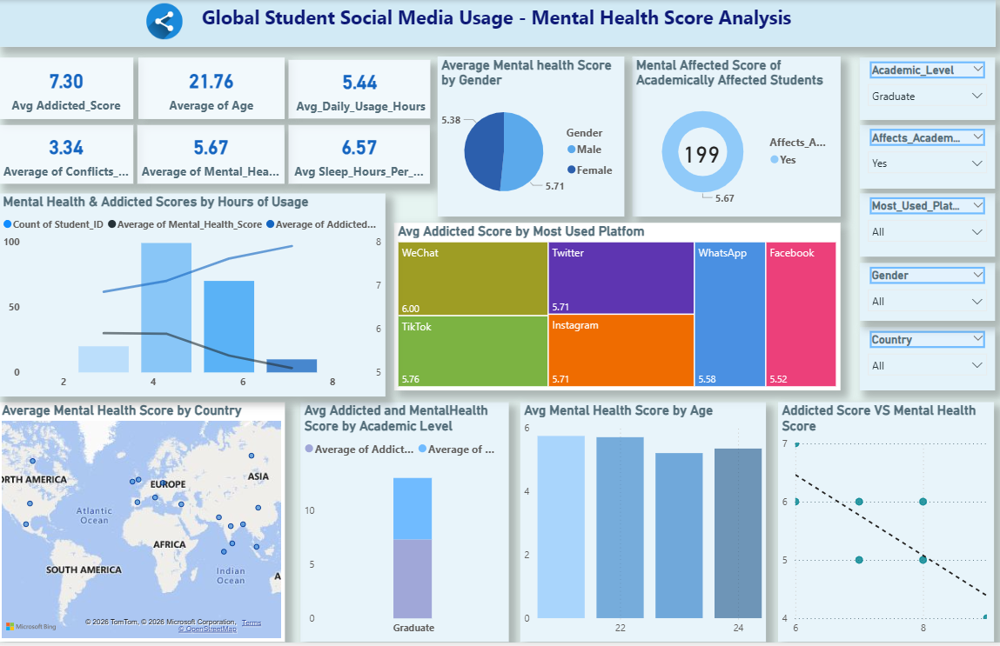

# Global-Student-Social-Media-Usage-Addiction-and-Mental-Health-Analysis
## Project Overview

This project focuses on analyzing global student social media usage data to understand its impact on addiction levels, mental health, academic performance, sleep patterns, and conflicts.
The interactive dashboards provide clear insights to support data-driven awareness, digital well-being analysis, and academic research.

## Tools & Technologies Used

Power BI – Data modeling and interactive dashboard creation
Microsoft Excel / CSV – Data preprocessing and storage
DAX – KPI and calculated measure creation
Power BI Visuals – Charts, maps, KPI cards, and slicers

## Data Preparation

Removed duplicate and missing records
Standardized categorical values (Gender, Platform, Academic Level)
Ensured numerical consistency for usage hours and scores
Created calculated KPIs such as average addiction score, mental health score, daily usage hours, sleep hours, and academic impact metrics

## Dashboard Features

KPI cards for addiction score, mental health score, usage hours, sleep hours, and age
Interactive slicers for academic level, gender, country, platform, and academic impact
Visual analysis by age, gender, country, and social media platform
Relationship analysis between usage hours, addiction, and mental health
Clean and user-friendly layout for quick and meaningful insights

## Dashboard

### 👩‍💻 About Me
**Bishnupriya Pattnaik**  
Aspiring **Data Analyst** | Skilled in **Python, SQL, Power BI, Excel, and Data Visualization**  

 Connect with me on :[LinkedIn](https://www.linkedin.com/in/bishnupriya-pattnaik)  

📊 Always exploring **data insights** and building meaningful **dashboards**.
